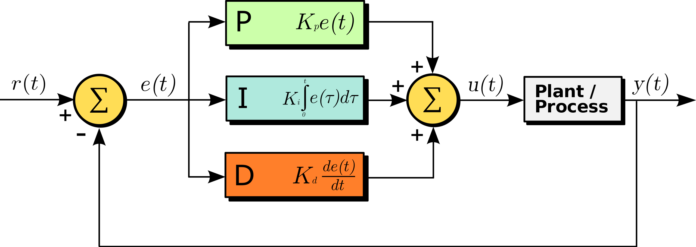
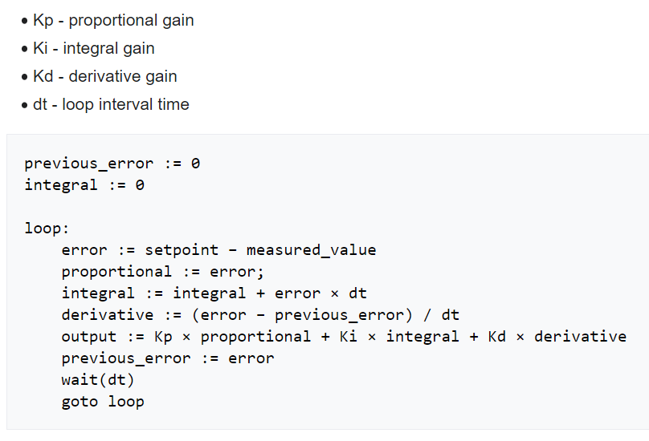
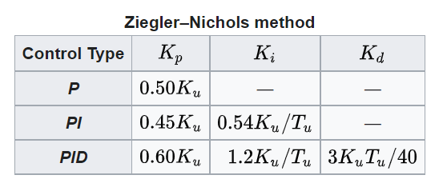
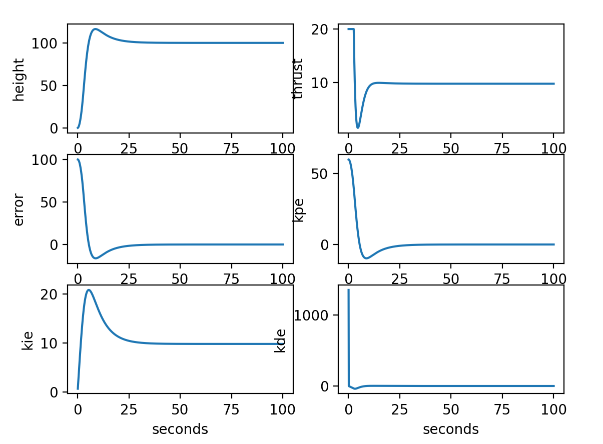
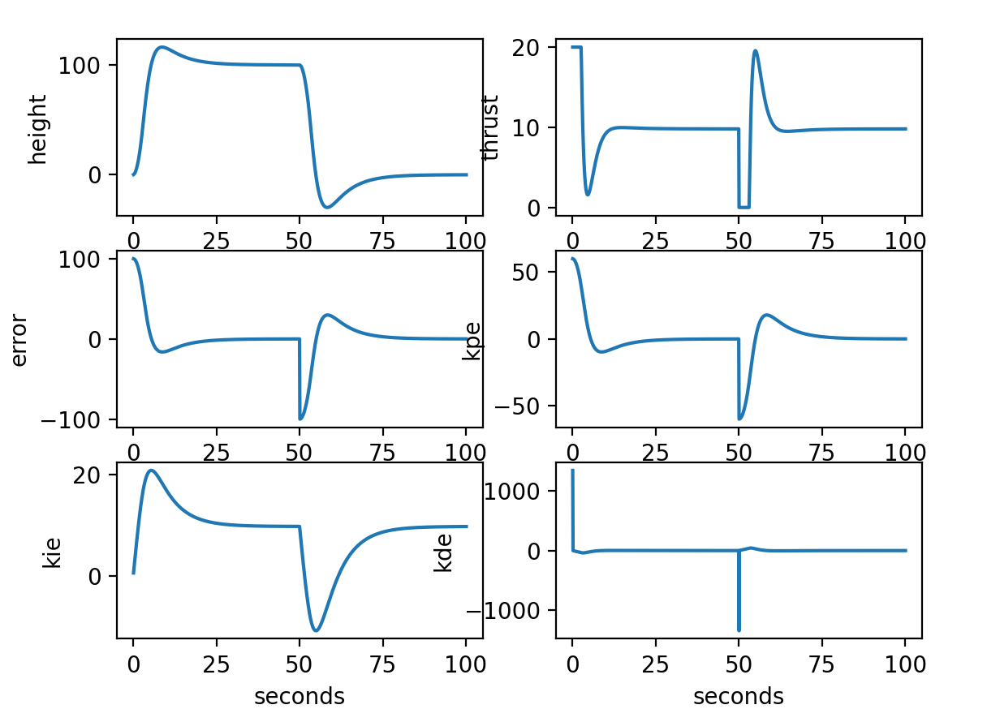

# Rocket PID simulation
Created a simple PID simulation for a rocket stabilizing in altitude and coming back down.

## PID
PID works by using a feedback loop that calculates the error value between a desired value and the measured value. Then correction is applied to the plant from the controller with the terms proportional, integral and drivative. The proportional term gives weight to the error. The integral term accumulates the error correcting the steady state error. The derivative term determines the slope of the error to give a dampening behavior.\
\

## PID Tuning
Using control theory math to calculate terms and stability.

Simple ratio tuning
Set Ki and Kd to 0 and increase Kp until the output of the loop have steady oscillations; this becomes Ku. Tu is the oscillation period.\
\

## Plots
Rocket goes up to 100 m and hovers, then comes back down to ground. Have not yet account for dropping through ground.\
\

